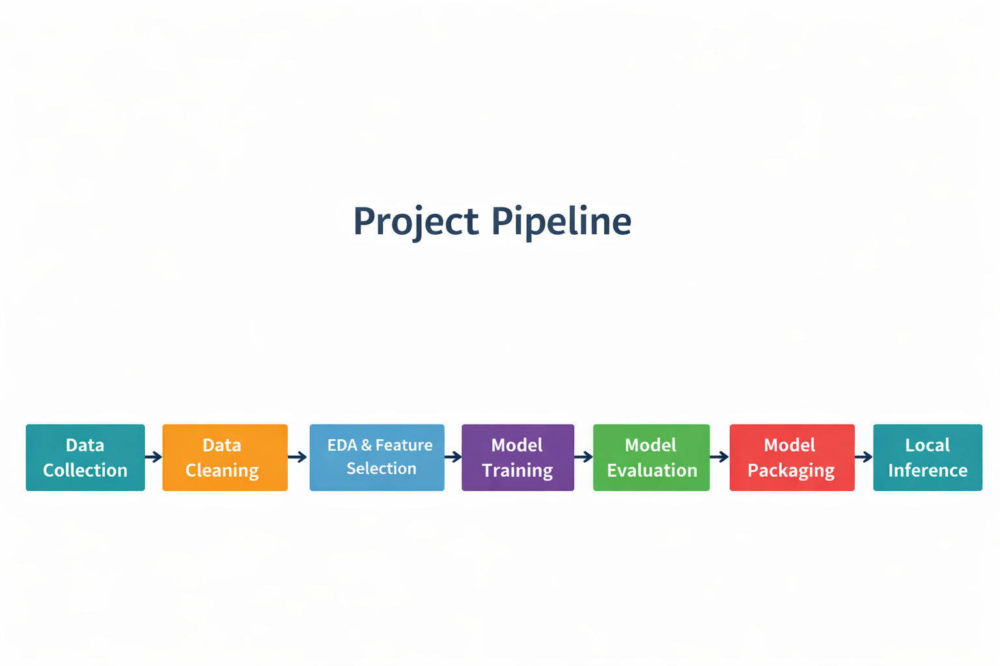
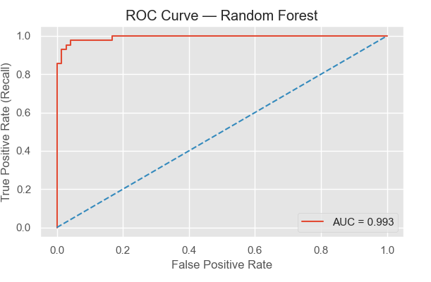
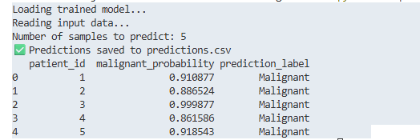

# Breast Cancer Diagnosis — Machine Learning Project


## Overview

This project builds a machine learning classifier to predict whether a breast tumor is **Malignant vs Benign** using structured diagnostic imaging features.

The primary objective is to **maximize Recall (Sensitivity)** to minimize missed malignant cases — a critical requirement in cancer screening systems.

The project demonstrates a complete end-to-end machine learning workflow, including model training, evaluation, and a reusable inference script.

---

## Project Pipeline



The diagram above summarizes the full workflow used in this project — from dataset preparation to model inference.

---

## Dataset

This project uses the **Wisconsin Breast Cancer Diagnostic Dataset**.

The dataset contains numeric features extracted from digitized images of breast mass cell nuclei, such as:

- radius
- texture
- compactness
- concavity

These measurements are commonly used in clinical diagnostic modeling.

Dataset file included in this repository:

data/breast_cancer.csv

Dataset source:  
https://archive.ics.uci.edu/ml/datasets/Breast+Cancer+Wisconsin+(Diagnostic)

---

## Models Compared

- Logistic Regression
- Random Forest
- XGBoost

Model selection prioritized **Recall** to minimize false negatives.

---

## Final Model

**Random Forest**

Key performance (test set):

| Metric | Score |
|------|------|
| Recall | 0.9286 |
| ROC-AUC | 0.9934 |
| Precision | 0.975 |
| Accuracy | 0.9649 |

---

## Model Evaluation

### ROC Curve



The ROC curve demonstrates strong class separation between malignant and benign tumors.

---

## Local Inference Demo

After training and evaluation, the final model was serialized and packaged for reuse.

Trained model location:

artifacts/model.joblib

Sample input file:

sample_input.csv

### Run Prediction Locally

Open a terminal in the project root folder and run:

```bash
pip install -r requirements.txt
python src/predict.py sample_input.csv

---

### Output

The script generates:

predictions.csv

The output file includes:

malignant probability

predicted class label (Malignant / Benign)

Example Terminal Output

-----




---

## Repository Structure


Breast-Cancer-Diagnosis-ML/
│
├── assets/
│   ├── github_banner_colored.png
│   ├── roc_curve.png
│   ├── model_pipeline.png
│   └── inference_demo.png
│
├── artifacts/
│   └── model.joblib
│
├── data/
│   └── breast_cancer.csv
│
├── notebook/
│   └── Breast_Cancer_diagnosis_project.ipynb
│
├── src/
│   └── predict.py
│
├── sample_input.csv
├── requirements.txt
├── README.md
└── .gitignore

----

## Skills Demonstrated

- Supervised Machine Learning
- Model Evaluation (Recall, ROC-AUC)
- Feature Importance Analysis
- Model Serialization (joblib)
- Local ML Inference Pipeline

---

## Author
Krishna Joshi  
Machine Learning — Healthcare Analytics


